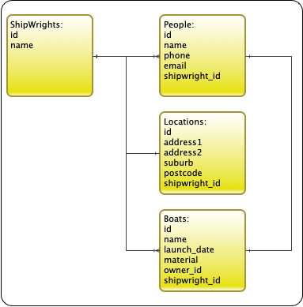
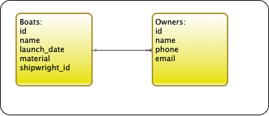
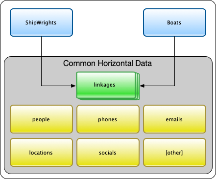

# chorizo

## Introduction

Common Horizontal data - data that needs to be atomic and be available across applications.

Let's examine an example.

Imagine two "domains" 1) a `ShipWrights` domain and 2) a `Boats` domain:

> Note only data pertinent to this example are shown. Obviously there would be more data in each domain.

Now it is clear from this that there is duplication of data.
And worse, it is clear that there is a potential for a mismatch.
For example, what happens if the a person in the ship wrights domain changes their phone number but this is not reflected in the boats domain?

The first thing that could be done is to extract all the common data into a separate common domain.
That is, store people, locations and other common items in a separate domain.
Then the issue is to link from the ship wrights and boats domain to the new common domain.
We don't want linkages like `shipwright_id` or people who are not owners mish-mashed together.

This is where `chorizo` comes in.

So we can reconstruct the domains like this:

In this manner, a person can be atomic and unique across external domains.
The same is true for locations, emails and so on.
Other units of data can be used such as organizations.

But how do we cater for cases like a person having multiple phone numbers, but only one is the primary contact?
Furthermore, how do we cater for a similar case where a person has a primary contact when related to a ship wright but not when related to a boat?
Or when a phone number is `active` for a ship wright but `inactive` for a boat?

The linkage data handles this using active flags and priority statuses at all levels.

By doing this, an app could, for example, search for a persons name, and from that obtain their phone numbers.
And from that locate all organizations that have that number.
And from that get the departments in that organization.
And from that get all the people in each department.
And so on.

In effect it is a simple graph that links all these atoms of data together.

## Acknowledgements

## Usage

## Details

## Installation

Add this line to your application's Gemfile:

    gem 'chorizo'

And then execute:

    $ bundle install

Or install it yourself as:

    $ gem install chorizo

## Testing

    clear; bundle exec rake; bundle exec rubocop

I used `minitest` for testing to reduce any external dependencies.

## Git

[Full details](./GitFlow.md)

[Bash details](./GitBash.md)

### Versioning

To release a new version, update the version number in `version.rb`, and then run `bundle exec rake release`, 
which will create a git tag for the version, push git commits and tags, and push the `.gem` file to [rubygems.org](https://rubygems.org).

This should only be done on the `master` branch.

## Contributing

Bug reports and pull requests are welcome on GitHub at https://github.com/ZenGirl/JFormalize. 
This project is intended to be a safe, welcoming space for collaboration, and contributors are expected to 
adhere to the [Contributor Covenant](http://contributor-covenant.org) code of conduct.

## License

The gem is available as open source under the terms of the [MIT License](https://opensource.org/licenses/MIT).

